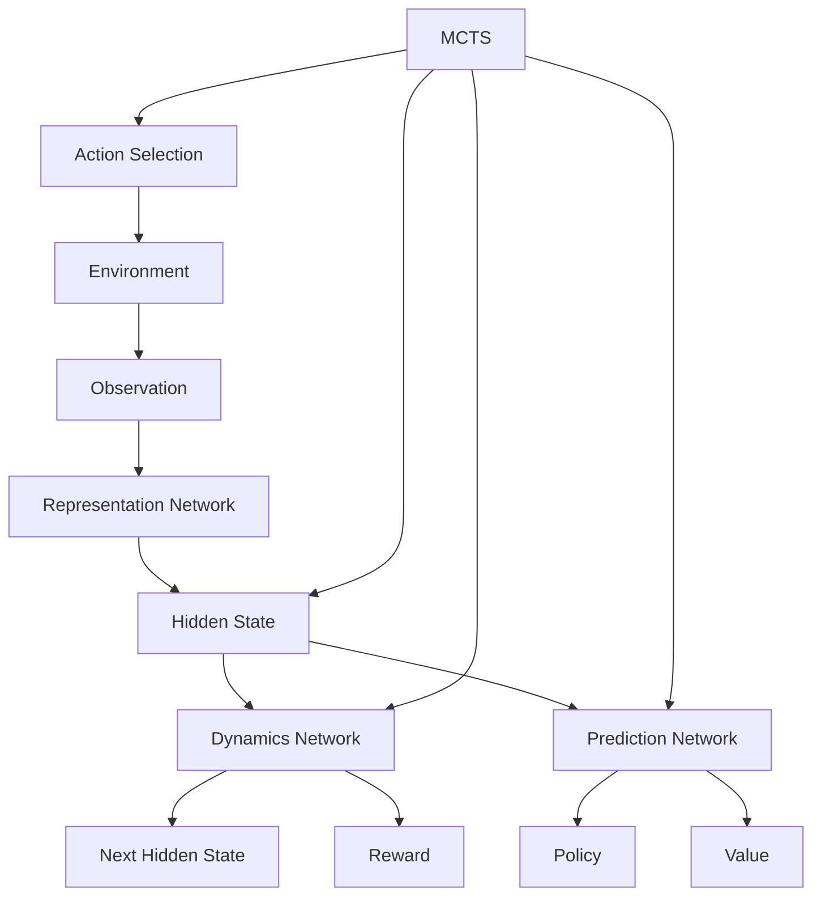

# MuZero Chess Agent Architecture

## Overview

This document describes the architecture of a simplified MuZero reinforcement learning agent designed to play chess. MuZero is a model-based reinforcement learning algorithm that learns a model of the environment and uses it for planning.

## MuZero Algorithm Components



### 1. Representation Network
- Takes the current observation (chess board state) as input
- Outputs an initial hidden state that encodes the observation
- For chess, this would encode the board position, piece positions, etc.

### 2. Dynamics Network
- Takes the current hidden state and an action as input
- Outputs the next hidden state and predicted reward
- Models the transition dynamics of the environment

### 3. Prediction Network
- Takes the current hidden state as input
- Outputs a policy (probability distribution over actions) and value (expected future reward)
- Used for decision making during planning

## Chess Environment Design

### State Representation
- Using python-chess library for board representation
- Board state encoded as a tensor representation suitable for neural networks
- Include information about:
  - Piece positions
  - Player to move
  - Castling rights
  - En passant targets
  - Move count

### Action Space
- All legal moves in the current position
- Encoded as indices in a fixed-size action space
- Mapping between action indices and UCI notation moves

### Reward Structure
- +1 for winning
- -1 for losing
- 0 for draw or ongoing game

## Core Implementation Plan

### 1. Neural Network Architecture
```
mermaid
graph TD
    A[Input: Board State] --> B[ResNet Blocks]
    B --> C[Policy Head]
    B --> D[Value Head]
    B --> E[Reward Head]
    
    C --> F[Action Probabilities]
    D --> G[State Value]
    E --> H[Reward Prediction]
```

### 2. MCTS Implementation
- Tree search using the learned model
- UCB1 action selection
- Backup of value estimates

### 3. Training Process
1. Self-play games using MCTS
2. Storage of game trajectories in replay buffer
3. Training of neural networks on sampled trajectories
4. Periodic evaluation of new networks

## Implementation Steps

1. Design chess environment with python-chess
2. Implement neural network components
3. Create MCTS implementation
4. Develop training loop
5. Add evaluation framework
6. Document implementation

## Key Simplifications

For this simplified implementation:
- Use smaller ResNet architecture
- Limited MCTS simulations per move
- Simplified training process
- Focus on core concepts rather than optimization