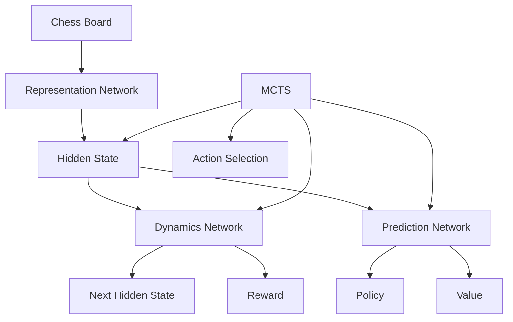

# MuZero Chess Agent Documentation

## Overview

This documentation provides a comprehensive guide to the MuZero chess agent implementation. The agent uses the MuZero reinforcement learning algorithm to learn to play chess through self-play, without any prior knowledge of the game rules beyond the basic mechanics.

## Table of Contents

1. [Architecture](#architecture)
2. [Components](#components)
3. [Installation](#installation)
4. [Usage](#usage)
5. [Training](#training)
6. [Evaluation](#evaluation)
7. [Customization](#customization)

## Architecture

The MuZero chess agent follows the MuZero algorithm architecture, which consists of three main neural network components:

1. **Representation Network**: Encodes the current observation (chess board state) into a hidden state
2. **Dynamics Network**: Predicts the next hidden state and reward given the current hidden state and action
3. **Prediction Network**: Predicts the policy (action probabilities) and value (expected future reward) from the hidden state

These components work together with Monte Carlo Tree Search (MCTS) to plan moves during gameplay.

## Components

### 1. Chess Environment (`chess_environment.py`)

The chess environment provides the interface between the MuZero agent and the chess game:

- Uses the `python-chess` library for accurate chess rules implementation
- Encodes board positions as 8x8x19 tensors for neural network input
- Handles action encoding/decoding between neural network indices and UCI moves
- Provides reward calculation based on game outcomes

### 2. Neural Networks (`muzero_network.py`)

The neural network components implement the core MuZero architecture:

- **Representation Network**: 16 residual blocks processing board state
- **Dynamics Network**: Processes hidden state and action to predict next state and reward
- **Prediction Network**: Outputs policy and value predictions
- All networks use PyTorch for efficient GPU acceleration

### 3. MCTS (`mcts.py`)

The Monte Carlo Tree Search implementation for action selection:

- Implements UCB1 action selection
- Uses the learned model for planning
- Adds Dirichlet noise for exploration during training
- Supports configurable search depth and exploration parameters

### 4. Training